# TensorFlow-in-Practice

Join our Deep Learning Adventures community and become an expert in Deep Learning, TensorFlow, Computer Vision, Convolutional Neural Networks, Kaggle Challenges, Data Augmentation and Dropouts Transfer Learning, Multiclass Classifications and Overfitting and Natural Language Processing NLP as well as Time Series Forecasting 😀 Join us and earn your TensorFlow Developer Certificate! All while having fun learning and participating in our Deep Learning Trivia games 🎉  

Meetup page 😀    
https://www.meetup.com/Deep-Learning-Adventures

YouTube recordings of all Meetups 🎉    
http://bit.ly/deep-learning-tf  

Join us on Slack:  
https://join.slack.com/t/deeplearninga-nmk8930/shared_invite/zt-d52h9mm9-h~Q0ZXw5PXsTDzPIlNIvog

TensorFlow in Practice Specialization:  
https://www.coursera.org/specializations/tensorflow-in-practice

Visits Laurence's GitHub repository for this specialization:  
https://github.com/lmoroney/dlaicourse/

Differentiate yourself with the TensorFlow Developer Certificate:  
https://www.tensorflow.org/certificate

View our interactive presentations here. If you prefer static pdf presentations, please look at our Presentations folder above. Special attribution goes to Coursera and deeplearning.ai for allowing us to borrow some of their great content.

* Deep-Learning-Adventures-Chapter-1-Presentation-1  
https://docs.google.com/presentation/d/18nAqidaH_4CzZyh_1e23gR88aIgFxCuIT7YmMgmnjwg/edit?usp=sharing

* Deep-Learning-Adventures-Tensorflow-In-Practice-Presentation-2  
https://docs.google.com/presentation/d/1GEvlIo8g_OFWWq7S3Ob82wRh5NroXpVSivRvVjFpm4Q/edit?usp=sharing

* Deep-Learning-Adventures-Tensorflow-In-Practice-Presentation-3  
https://docs.google.com/presentation/d/1vKOwYrABaGCvHMM8wnK0vb6NNzfHLQREYQI2UXiFzJ0/edit?usp=sharing

* Deep-Learning-Adventures-Tensorflow-In-Practice-Presentation-4  
https://docs.google.com/presentation/d/1DAXyuNew5YDEzSakYjvbdIvCf_eNbZ6s69iyDBvHT2w/edit?usp=sharing

* Deep-Learning-Adventures-Tensorflow-In-Practice-Presentation-5  
https://docs.google.com/presentation/d/1gUJsRmuc_7beCoS3x2BiEWjJflcenyIQiqZMcyMLL-M/edit?usp=sharing

* Deep-Learning-Adventures-Tensorflow-In-Practice-Presentation-6  
https://docs.google.com/presentation/d/1KdKcq97grYYcTmkoEvwSOElK1TI_Son69CRae3wPk14/edit?usp=sharing

* Deep-Learning-Adventures-Tensorflow-In-Practice-Presentation-7  
https://docs.google.com/presentation/d/1UiIgy06YmYx8z1o23Z7Qb9ZyIFWismF52OSBpUq8niA/edit?usp=sharing

Practice your skills while having fun with our Deep Learning Trivia games 🎉  
* Deep Learning Trivia Game 1, covering basic TensorFlow syntax, Keras, dense network, optimizer and more:    
https://quizizz.com/join/quiz/5e87bdbc07fa7f001b120404/start?from=soloLinkShare&referrer=5d921444d0fa99001a135336

* Deep Learning Trivia Game 2, covering computer vision, Fashion-MNIST, sparse categorical and binary crossentropy loss, convolutional neural networks, max pooling, ImageDataGenerator and more:  
https://quizizz.com/join/quiz/5e90e8e631fb32001f63510b/start?from=soloLinkShare&referrer=5d921444d0fa99001a135336

* Deep Learning Trivia Game 3  
https://quizizz.com/join/quiz/5eae10a807df73001b0c59a4/start?from=soloLinkShare&referrer=5d921444d0fa99001a135336

* Deep Learning Trivia Game 4  
https://quizizz.com/join/quiz/5eb71e0e09cdea001c916ac6/start?from=soloLinkShare&referrer=5d921444d0fa99001a135336

* Deep Learning Trivia Game 5  
https://quizizz.com/join/quiz/5eefd13d3db4b8001bb6d72b/start?from=soloLinkShare&referrer=5d921444d0fa99001a135336

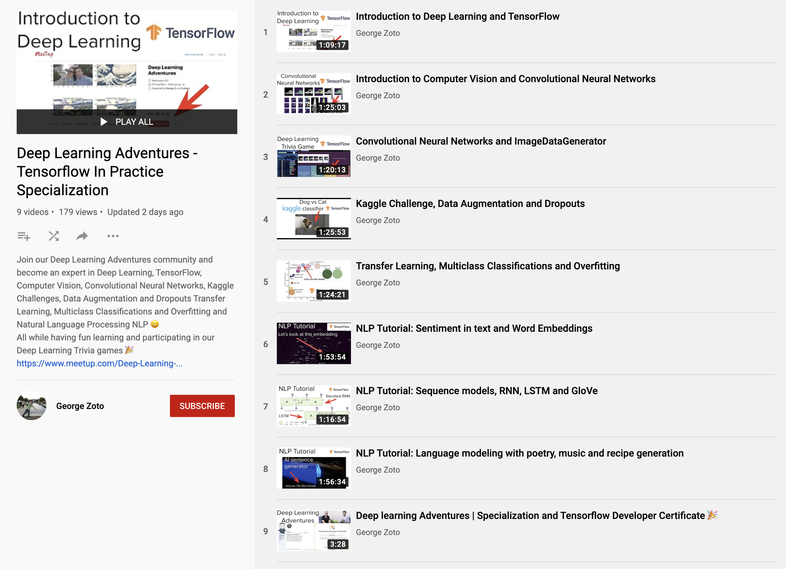
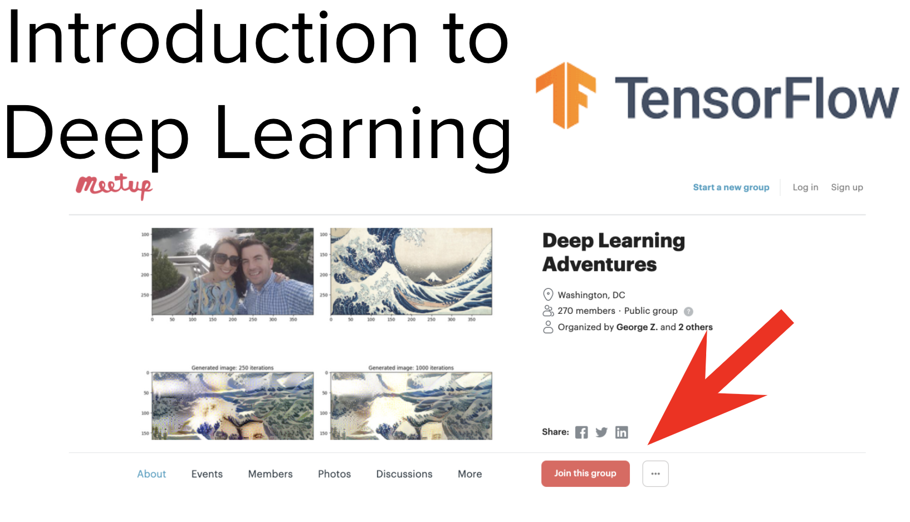
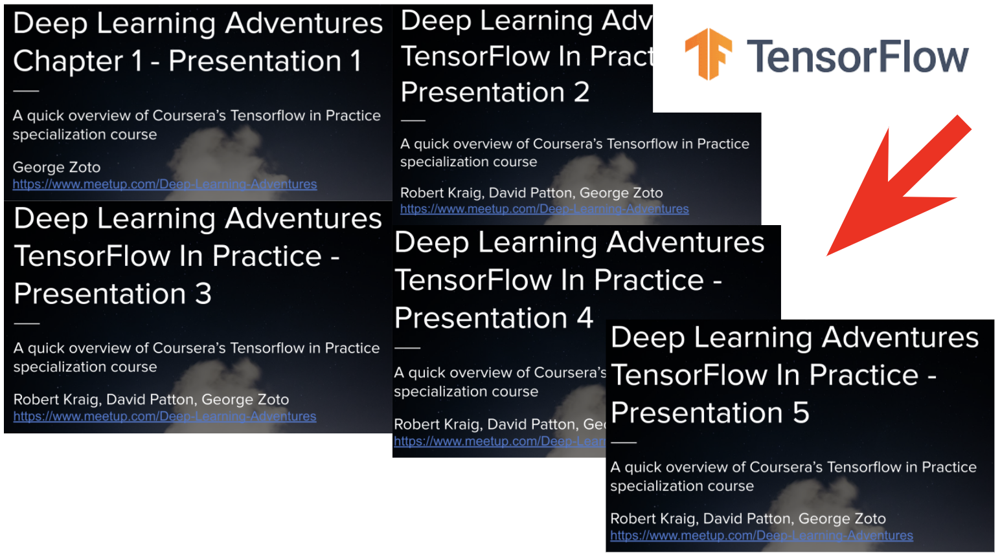
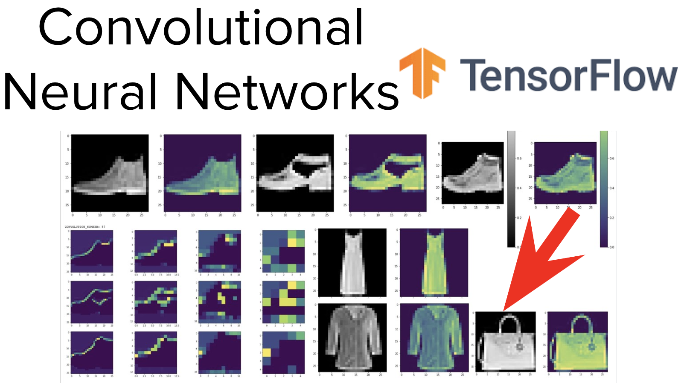
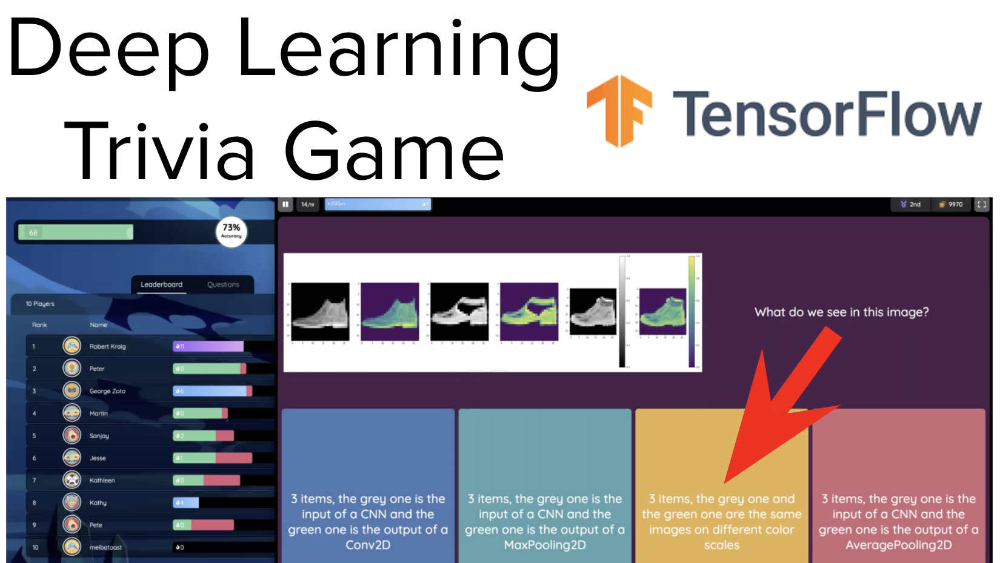
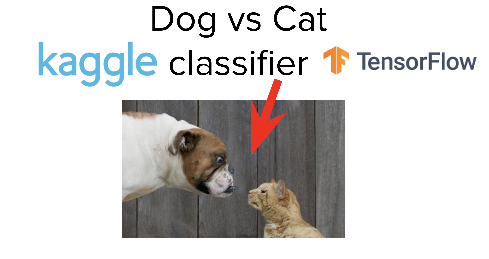
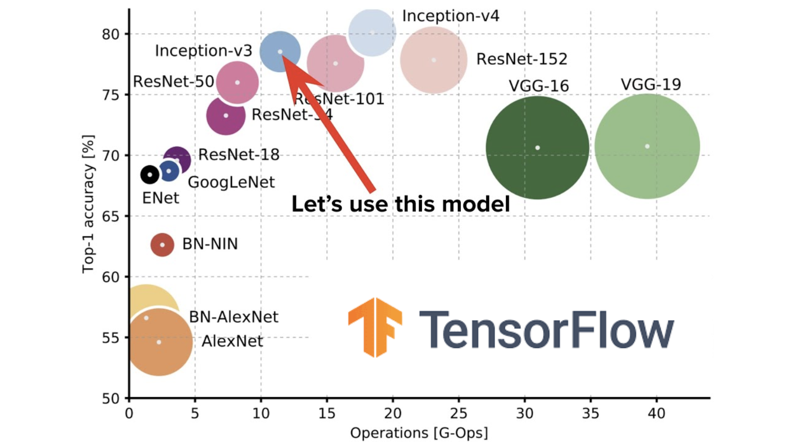
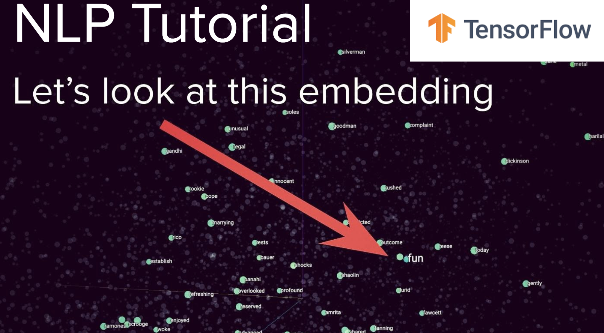
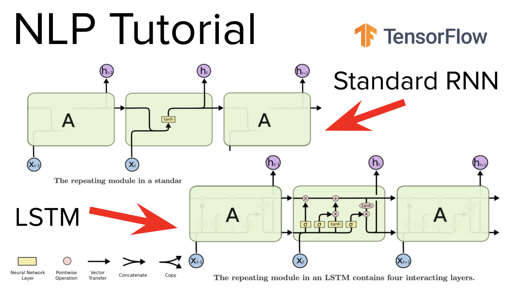
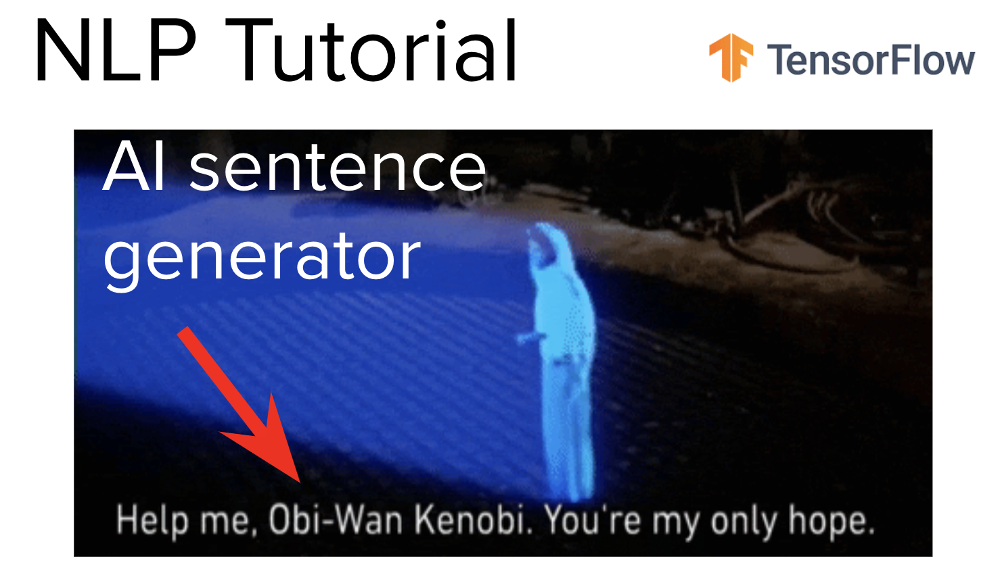
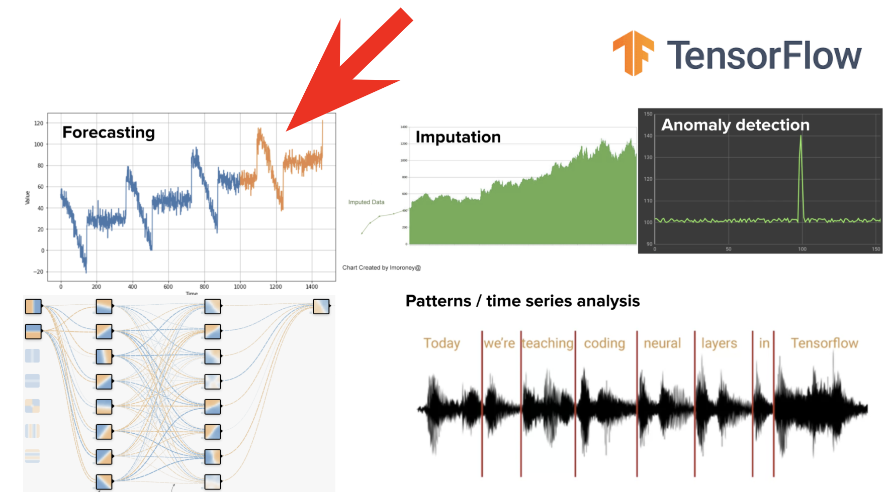

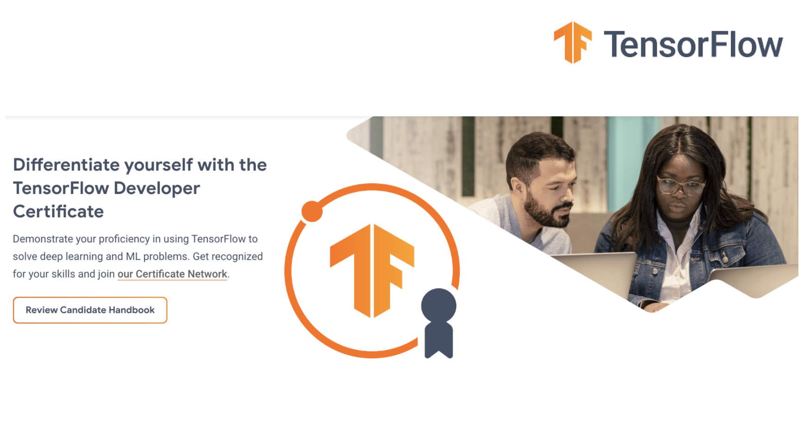

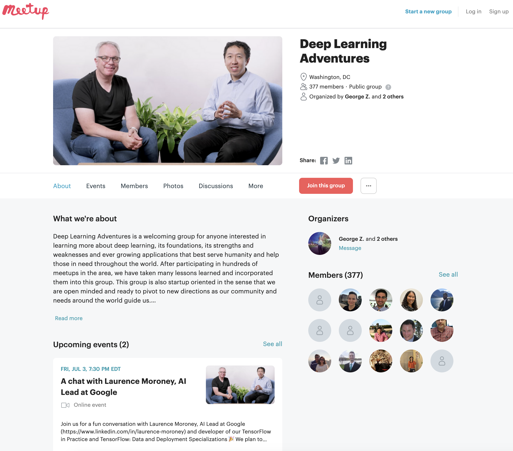

