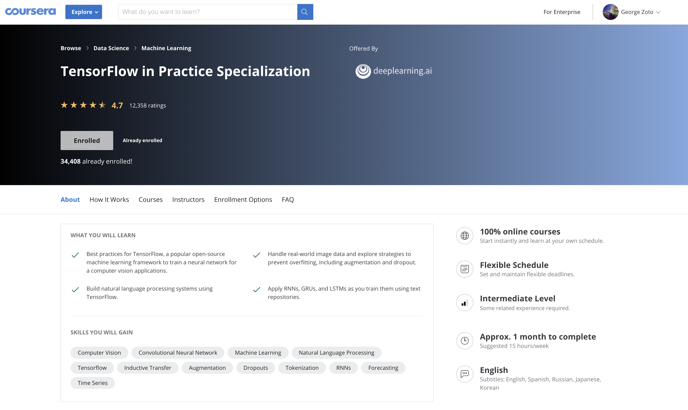
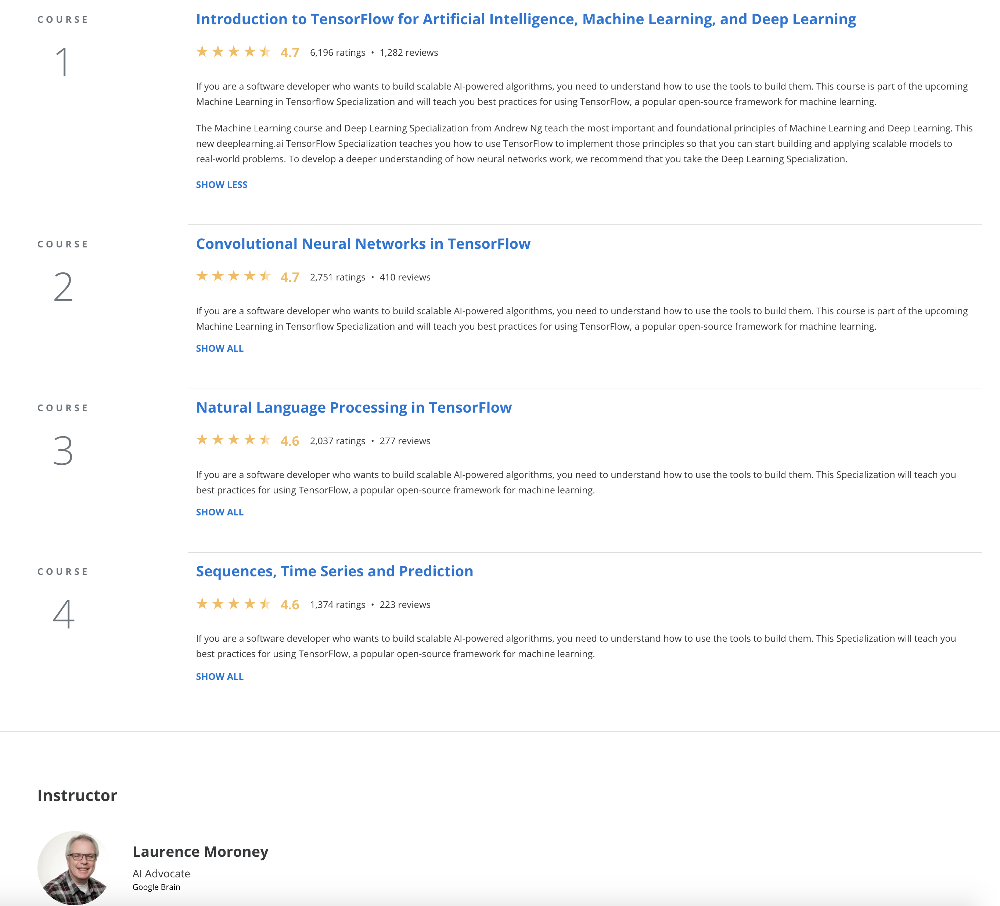
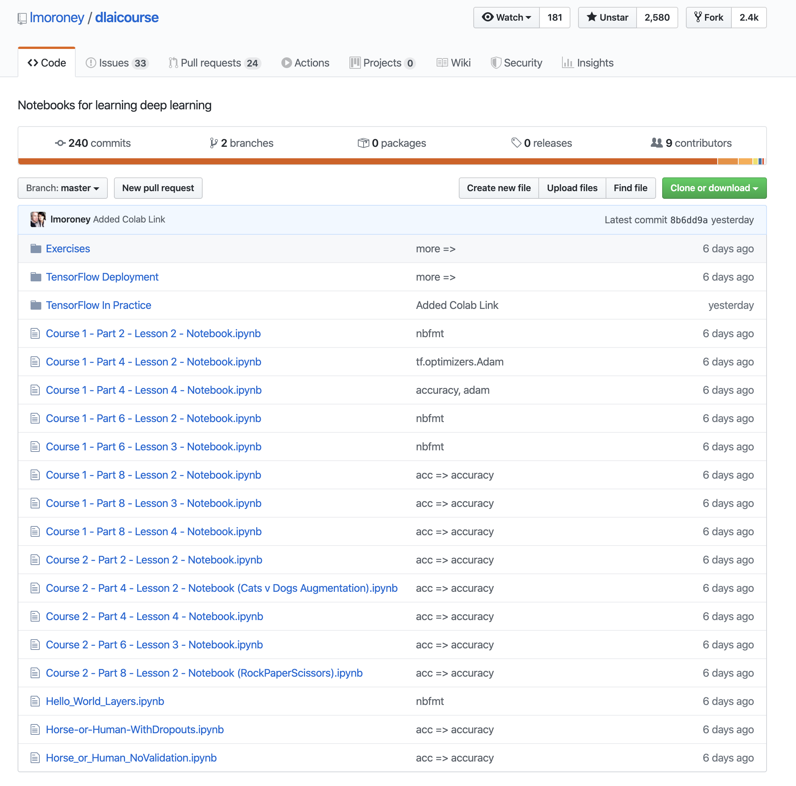

# TensorFlow-in-Practice

Code repository for TensorFlow in Practice Specialization at:  
https://www.coursera.org/specializations/tensorflow-in-practice

Visits Laurence's github repository for this specialization at:  
https://github.com/lmoroney/dlaicourse/

